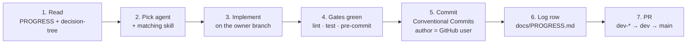
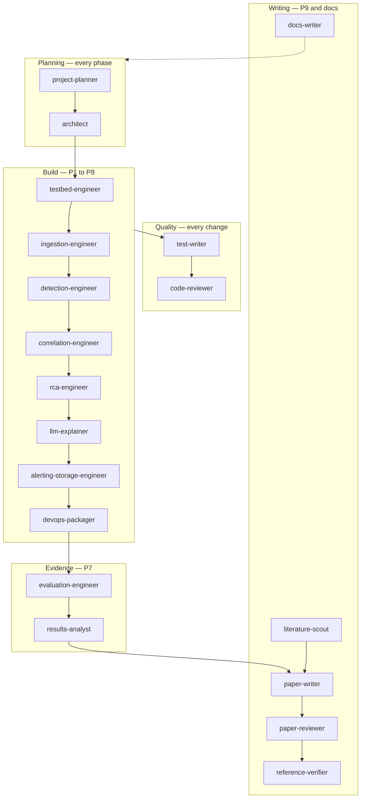

# Agent workflow

How InfraMind is built: one human owner, one agent, one skill, green gates, then a commit on that owner's branch.

The catalog below is the working set. Contracts live in [`.claude/agents/`](../.claude/agents/). Procedures live in [`standards/`](standards/README.md); skills are the short entrypoints that point at those files.

## 1. Session loop

1. Read [`PROGRESS.md`](PROGRESS.md) (current phase) and [`decision-tree.md`](decision-tree.md) (locked rules).
2. Pick **one** agent for the task. Load the skill in the table in section 4 before writing code.
3. Work on that member's branch: `dev-rifat`, `dev-moneem`, or `dev-prome`. Shared integration is `dev`. Never commit on `main`.
4. Do not commit until the applicable gates pass: `pre-commit run --all-files`, `make lint`, `make test`. See [commit-protocol](../.claude/skills/commit-protocol/SKILL.md).
5. Commit message is [Conventional Commits](https://www.conventionalcommits.org/). The author is the GitHub user on the commit. Do not add `GitHub-Author` or `Co-authored-by` trailers.
6. Append one row to [`PROGRESS.md`](PROGRESS.md) in the same change.
7. Open a pull request: personal branch → `dev`, then `dev` → `main` at a milestone. Squash-merge after CI is green.

Phase exit checklists (P0 through P9) are the [`phase-gates`](../.claude/skills/phase-gates/SKILL.md) skill. A phase does not start until the previous gate is green.

## 2. What wins when docs disagree

1. Running code and tests
2. [`decision-tree.md`](decision-tree.md) — what the system is and why
3. [`CLAUDE.md`](../CLAUDE.md) — team, hard rules, layout
4. [`standards/`](standards/README.md) — how to write and run it
5. [`.claude/skills/`](../.claude/skills/) — task entrypoints
6. [`.claude/agents/`](../.claude/agents/) — who may change which directory

## 3. Who calls whom

The arrows show **phase ordering**, not call direction. Each agent is
**invoked independently** by a human owner — agents do not dispatch one
another. `test-writer` and `code-reviewer` ride along with every build
agent; `docs-writer` updates docs whenever a contract changes.

## 4. Agent, owner, skill, phase

| Agent | Human | Skill to load | Phase |
|---|---|---|---|
| `project-planner` | team | `phase-gates` | every |
| `architect` | team | — (decision-tree + ARCHITECTURE) | every |
| `testbed-engineer` | Rifat | `testbed-ops` | P1 |
| `ingestion-engineer` | Moneem | `signal-schema`, `add-collector` | P2–P3 |
| `detection-engineer` | Moneem | `add-detector` | P4 |
| `correlation-engineer` | Moneem | `signal-schema` | P4b |
| `rca-engineer` | Prome | `rca-scoring` | P5 |
| `llm-explainer` | Prome | `llm-evidence-explainer` | P5b |
| `alerting-storage-engineer` | Prome | `signal-schema` | P6 (alerting + storage + API) |
| `devops-packager` | Rifat | `helm-packaging` | P8 |
| `test-writer` | owner of the change | `python-standards` | every |
| `code-reviewer` | reviewer | `commit-protocol` | every PR |
| `evaluation-engineer` | Rifat | `fault-scenario`, `run-evaluation` | P7 |
| `results-analyst` | Prome | `results-to-latex` | P7–P9 |
| `literature-scout` | team | `paper-writing` | P9 |
| `paper-writer` | team | `paper-writing` | P9 |
| `paper-reviewer` | team | `paper-writing` | P9 |
| `reference-verifier` | team | `reference-verification` | P9 |
| `docs-writer` | team | — | every |

Files: `.claude/agents/<category>/<name>.md`.

| Category | Agents |
|---|---|
| `planning/` | `project-planner`, `architect` |
| `build/` | `testbed-engineer`, `ingestion-engineer`, `detection-engineer`, `correlation-engineer`, `rca-engineer`, `llm-explainer`, `alerting-storage-engineer`, `devops-packager` |
| `quality/` | `test-writer`, `code-reviewer` |
| `evidence/` | `evaluation-engineer`, `results-analyst` |
| `writing/` | `literature-scout`, `paper-writer`, `paper-reviewer`, `reference-verifier`, `docs-writer` |

## 5. Skills

| Skill | Open this standard |
|---|---|
| `phase-gates` | the skill itself (P0→P9 checklists) |
| `commit-protocol` | [`08-commit-protocol.md`](standards/08-commit-protocol.md) |
| `python-standards` | [`02-python-standards.md`](standards/02-python-standards.md) |
| `signal-schema` | [`03-signal-schema.md`](standards/03-signal-schema.md) |
| `add-collector` | [`04-add-collector.md`](standards/04-add-collector.md) |
| `add-detector` | [`05-add-detector.md`](standards/05-add-detector.md) |
| `rca-scoring` | [`06-rca-scoring.md`](standards/06-rca-scoring.md) |
| `llm-evidence-explainer` | [`07-llm-explainer.md`](standards/07-llm-explainer.md) |
| `testbed-ops` | [`09-testbed-ops.md`](standards/09-testbed-ops.md) |
| `fault-scenario`, `run-evaluation` | [`10-evaluation.md`](standards/10-evaluation.md) |
| `helm-packaging` | [`11-helm-packaging.md`](standards/11-helm-packaging.md) |
| `paper-writing`, `reference-verification`, `results-to-latex` | [`12-paper-writing.md`](standards/12-paper-writing.md) |

## 6. Branches inside the loop

| Branch | Commits from |
|---|---|
| `dev-rifat` | `testbed-engineer`, `devops-packager`, `evaluation-engineer` |
| `dev-moneem` | `ingestion-engineer`, `detection-engineer`, `correlation-engineer` |
| `dev-prome` | `rca-engineer`, `llm-explainer`, `alerting-storage-engineer`, `results-analyst` |
| `dev` | integration PRs from the three branches above |
| `main` | milestone PRs from `dev` only |

Paper and docs agents commit on the branch of whoever is writing that day,
then PR into `dev`. The `docs-writer` agent has no fixed owner branch —
docs-only PRs land on whichever branch the affected code lives on, or on
`dev` for cross-cutting changes. `paper-*` and `literature-scout` agents
follow the same rule.

## 7. Proposal deltas the agents must keep

The July 2026 [`proposal.pdf`](proposal.pdf) is the academic reference. These repo rules override ambiguous proposal wording. They are logged in [`decision-tree.md`](decision-tree.md):

- **D1** — the graph ranks; the LLM only summarises.
- **D2** — edges are caller → callee; RCA walks toward callees.
- **D5** — Online Boutique or OpenTelemetry Demo, on kind.
- **D6** — at least 12 scenarios, 5 runs, plus a fault-free soak.
- **D7** — six baselines, including raw Alertmanager and LLM-only.
- **D8** — no cloud, Datadog, ELK, auto-remediation, or deep-learning training.

## 8. Definition of done

1. Code, type hints, and docstrings on public functions.
2. Unit tests written and passing.
3. `make lint` clean.
4. A new row in `docs/PROGRESS.md`.
5. Commit follows section 1 (gates, Conventional Commits, author is the GitHub user).
6. RCA or evaluation changes are reproducible from a scenario id and a seed.
