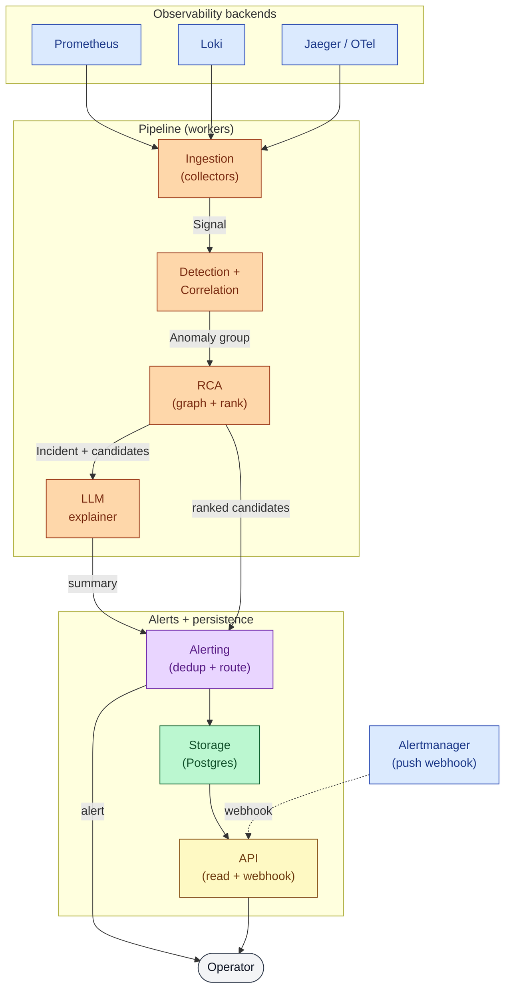
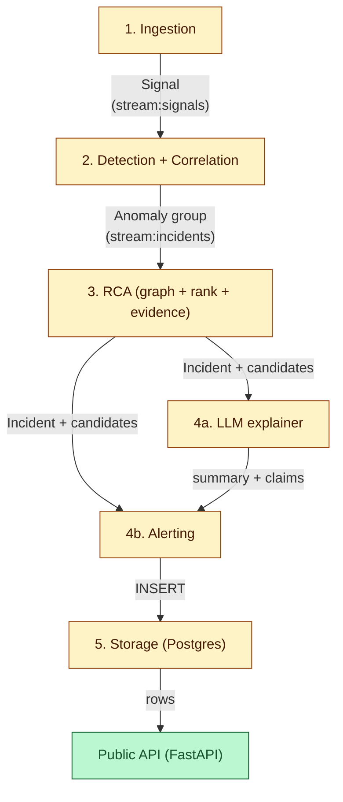
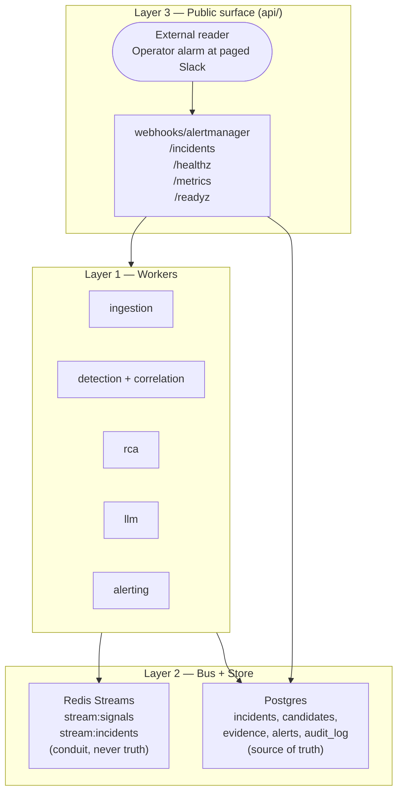
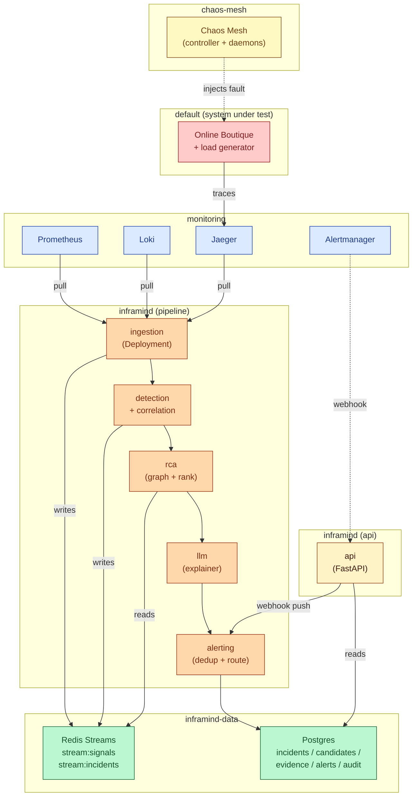

# Architecture — InfraMind

InfraMind is a **Kubernetes-native incident detection + root-cause analysis** system. When a
fault hits a microservice application, InfraMind says **which service is the root cause, with
evidence**, and sends one deduplicated alert. The ranking is **deterministic** — the LLM
only summarises evidence; it never picks the root cause (D1). The pipeline runs as long-lived
workers on a kind cluster, with Redis Streams as the conduit and PostgreSQL as the source
of truth.

The *why* of every choice lives in [`docs/decision-tree.md`](decision-tree.md). The wire
contracts (signal schemas, env keys, API surface) live in
[`docs/surface-map.md`](surface-map.md). The conventions live in
[`docs/standards/`](standards/README.md).

**Audience.** New contributors, the paper's §System Design, and the supervisor / external
reader who lands on this file cold.

---

## 1. The one-screen view



*Observability backends feed ingestion. Ingestion publishes `Signal` objects onto the bus.
Detection + correlation produces anomaly groups. RCA ranks candidates with the dependency
graph. The LLM summarises the evidence bundle; alerting dedupes and routes; storage
persists. The API serves the webhooks and the read endpoints.*

ASCII fallback (terminal / `cat` readers):

```
  +----------------------------------------------------------+
  | Observability backends                                    |
  |   Prometheus   Loki   Jaeger / OTel   Alertmanager        |
  +--------+-----------------+------------------+-------------+
           |                 |                  |
           | pull            | pull             |  webhook (push)
           v                 v                  +--------+
  +--------+-------+   +-----+----+   +---------+        |
  |  Ingestion    |-->| Detection |-->|   R C A |        |
  |  (collectors) |   | + Correl. |   | (graph) |        |
  +---------------+   +-----------+   +----+----+        |
                                          |              v
                                   +------v-----+   +----+----+
                                   |    L L M   |   |  API   |
                                   |  explainer |   | (read) |
                                   +------+-----+   +-----+--+
                                          | summary      ^
                                          v              |
  +----+----------------------------+    |        +------+------+
  |  Storage (Postgres) |<----------+----+        | Alerting   |
  |  (incidents, evidence) |                      | (dedup +   |
  +-----------------------+                       |  route)    |
                                                  +-----+------+
                                                        |
                                                        | alert
                                                        v
                                                   +---------+
                                                   | Operator|
                                                   +---------+
```

---

## 2. The five-stage pipeline



ASCII fallback (terminal / `cat` readers):

```
  +---------------------------+
  |  1. Ingestion             |   <-- collectors pull
  +-------------+-------------+
                |
                | Signal (stream:signals)
                v
  +---------------------------+
  |  2. Detection + Correlation|
  +-------------+-------------+
                |
                | Anomaly group (stream:incidents)
                v
  +---------------------------+
  |  3. RCA                   |   <-- graph decides (D1)
  +-------------+-------------+
                |
       +--------+--------+
       |                 |
       v                 v
  +-----------+   +-----------+
  | 4a. LLM   |   | 4b. Alert |
  | explainer |---| (dedup +  |
  +-----------+   |  route)   |
        |        +-----+------+
        | summary      |
        +----->--------+
                       |
                       | INSERT
                       v
  +---------------------------+
  |  5. Storage (Postgres)    |   <-- incidents, evidence, audit
  +-------------+-------------+
                |
                | rows
                v
  +---------------------------+
  |  Public API (FastAPI)     |
  +---------------------------+
```

| # | Stage | Subpackage | Owner | Inputs | Outputs |
|---|---|---|---|---|---|
| 1 | **Ingestion** | `src/inframind/ingestion/` | Moneem | PromQL, LogQL, OTLP, Alertmanager webhook | `Signal` on `stream:signals` |
| 2 | **Detection + Correlation** | `src/inframind/detection/`, `src/inframind/correlation/` | Moneem | `Signal` from bus | `Anomaly` groups on `stream:incidents` |
| 3 | **RCA** | `src/inframind/rca/` (CORE) | Prome | `Anomaly` groups + service-call graph | ranked `Candidate[]` with `Evidence` |
| 4a | **LLM explainer** | `src/inframind/llm/` | Prome | `Incident` + `Candidate[]` | `summary` + `claims[]` (validated) |
| 4b | **Alerting** | `src/inframind/alerting/` | Prome | ranked candidates + LLM summary | deduplicated, severity-routed alert |
| 5 | **Storage** | `src/inframind/storage/` | Prome | incident / candidate / evidence / alert | Postgres rows |
| – | **API** | `src/inframind/api/` | Prome | webhook POST, `GET /incidents` | JSON responses |

The owner column mirrors the Team table in `CLAUDE.md`. The pipeline's two bus crossings
are the only shared state between workers — every other handoff is a function call inside
a process or an HTTP request from an external client.

**Contract pinned shapes** (`docs/surface-map.md`):

- `Signal` — the canonical observation. `ts` is observation time; `service` is
  lower-kebab-case; `attrs` is JSON-serialisable, no secrets (D9).
- `Anomaly` — a single detector firing on one signal.
- `Incident` — a grouped set of `Anomaly` objects with metadata (id, opened_at,
  closed_at, state, services, signals, candidates, primary, summary, alerts).
- `Candidate` — one possible root cause service and its evidence bundle.
- `Evidence` — one item in the bundle (metric snapshot, log line, trace span, change
  event).
- `Alert` — the rendered, redacted, deduplicated payload that goes out.

**Adjacent work, not in the runtime flow** (still owned, still pinned — see
[`CLAUDE.md`](../CLAUDE.md) Team table):

| Area | Owner | Subpackage / path |
|---|---|---|
| Testbed (kind cluster, observability stack, Chaos Mesh, Online Boutique) | Rifat | `testbed/` |
| Helm packaging for InfraMind itself (`make up` for the full stack) | Rifat | `deploy/helm/inframind/` |
| Evaluation harness (≥12 scenarios × 5 reps + 6 baselines + ablations) | Rifat | `evaluation/` |
| Agentic workflow (19 agents + 15 skills that ship the project) | team | `.claude/` |

---

## 3. Sequence: one fault, end to end

```mermaid
sequenceDiagram
    autonumber
    actor Op as Operator
    participant CM as ChaosMesh
    participant Pod as K8sPod
    participant Det as Detector
    participant Cor as Correlator
    participant RCA as RCA
    participant LLM as LLM
    participant Alt as Alerter
    participant PG as Postgres
    participant API as API

    Op->>CM: apply PodChaos (kill frontend)
    CM-->>Pod: SIGKILL at t=0s
    Pod-->>Det: metric + log + trace land
    Note over Det: Z-score fires at t=1s
    Det->>Cor: Anomaly(service=frontend, z=4.2)
    Cor->>Cor: sliding-window group + dedup
    Cor->>RCA: Incident opened at t=2s
    RCA->>RCA: walk toward callees (D2)
    RCA->>LLM: Incident + ranked candidates + evidence
    Note over LLM: redact (D9); call OpenAI / Ollama
    LLM-->>RCA: summary + claims[] (validated)
    RCA->>Alt: ranked candidates + summary
    Alt->>Alt: dedup, route by severity
    Alt-->>Op: alert (Slack / email / webhook)
    Alt->>PG: INSERT incident, candidate, evidence, alert
    PG-->>API: row visible at t=5s
    Op->>API: GET /incidents/{id}
    API-->>Op: 200 Incident JSON
```

ASCII fallback (terminal readers):

```
Op  CM    Pod   Det   Cor   RCA   LLM   Alt   PG   API
 |   |     |     |     |     |     |     |    |    |
 |---apply PodChaos (kill frontend)---------------------|
 |    |--SIGKILL-->|
 |    |    |--metric + log + trace land-->|
 |    |    |        Z-score fires (t=1s)|
 |    |    |          Anomaly(frontend, z=4.2)-->|
 |    |    |          group + dedup-->|
 |    |    |            Incident opened (t=2s)-->|
 |    |    |              walk toward callees (D2)|
 |    |    |                ranked candidates + evidence-->|
 |    |    |                  redact (D9) + LLM call|
 |    |    |                    summary + claims (validated)<-|
 |    |    |                      ranked candidates + summary-->|
 |    |    |                        dedup + route by severity|
 |    |    |<-----alert (Slack / email / webhook)|
 |    |    |                        INSERT incident + candidate + evidence + alert-->|
 |    |    |                          row visible (t=5s)------>|
 |<---GET /incidents/{id}------------------------------------|
 |    |    |                                              200 Incident JSON
```

*A fault is injected, three observability backends see it, the detector fires in ~1
second, correlation groups it into an incident in another second, the RCA walks the call
graph and bundles evidence, the LLM summarises with citation checking, the alerter sends
one deduplicated alert, and the storage layer persists the full audit row. End-to-end:
~5 seconds from fault to readable `Incident` JSON.*

The shape is the *typical* path. A detection may take longer if the rolling window is
warming up; the LLM call may retry on a validator failure; an alert may be suppressed by
dedup. None of these change the data flow — only the timing.

---

## 4. Layer view

Three layers: workers produce and consume; bus + store is shared state; HTTP is the only
ingress and egress.



ASCII fallback:

```
  Layer 3 (HTTP, api/)  :  webhooks/alertmanager, /incidents, /healthz, /metrics
       ^                       |
       |  read / write         v
  Layer 2 (bus + store) :  Redis Streams (conduit)  +  Postgres (truth)
       ^                       ^
       |  publish / INSERT     |  INSERT / SELECT
  Layer 1 (workers)    :  ingestion, detection+correlation, rca, llm, alerting
```

Three rules:

1. **Workers never call each other across layer 1.** A stage that needs the previous
   stage's output reads the bus. A stage that needs its own output reads the store.
3. **The bus is a conduit, never the truth.** Redis Streams entries can be trimmed; that
   does not lose data, because Postgres holds the same data durably. D20.
4. **HTTP is the only ingress.** The only POST the API accepts is the Alertmanager
   webhook; every other ingress is a pull by an external collector, and the only egress is
   the alerting payload + the read API.

---

## 5. Deployment view



**Legend.** Each color is one namespace:

- **yellow** — `chaos-mesh` (the fault injector; arrows from it are dashed).
- **red** — `default` (Online Boutique, the system under test; receives faults).
- **blue** — `monitoring` (Prometheus, Loki, Jaeger, Alertmanager; pulled by InfraMind).
- **orange** — `inframind/pipeline` (the 5 worker Deployments in call order).
- **gold** — `inframind/api` (the FastAPI Deployment; webhook ingress + read API).
- **green** — `inframind-data` (Redis as conduit, Postgres as source of truth).

Three edge styles carry meaning:

- **solid arrow** — direct pod-to-pod traffic (in-process call, push, or INSERT).
- **dashed arrow** — control-plane or fault injection (Chaos Mesh injecting, Alertmanager
  webhook push).
- **labelled arrow** — bus cross: `writes` (publish) or `reads` (consume) on a named Redis
  stream, or INSERT/SELECT on Postgres.

ASCII fallback (the same picture, for terminal readers):

```
  namespace: chaos-mesh                              namespace: default (SUT)
  +----------------------+   injects fault    +----------------------------+
  |   Chaos Mesh         | ------------------> |    |  Online Boutique       |
  | (controller+daemons) |                     |    |  + load generator       |
  +----------------------+                     |    +------------+-----------+
                                                |                 |
                                                |  traces         |
  namespace: monitoring                          |                 v
  +--------------------------------------------+--+   namespace: monitoring
  |  Prometheus   Loki   Jaeger   Alertmanager |       (Jaeger scrapes SUT)
  +-----+--------+----+--------+---------------+
        |        |    |         |
        | pull   |    |         | push  (webhook)
        |        |    |         v
        |        |    |    namespace: inframind (api)
        |        |    |    +-------------------+
        |        |    |    |  api  (FastAPI)   | <--- webhooks + read API
        |        |    |    +---------+---------+
        |        |    |              ^
        v        v    v              | reads
  namespace: inframind (pipeline)    |
  +-------------------+   +----------+----+   +-----+-----+   +--------+
  |   ingestion       |-->| detection     |-->|   rca     |-->|  llm   |
  | (collectors pull) |   | + correlation |   | (graph)  |   | (D1)   |
  +---------+---------+   +--------+-----+   +-----+-----+   +----+---+
            | writes              | writes           | reads         | summary
            v                    v                  v               v
  +---------------------+    +-----------------+   +-----------+   +-----+-----+
  |  Redis Streams      |<---| stream:incidents|   |  Redis    |   | alert    |
  |  stream:signals     |    +-----------------+   | (read)    |   | (dedup)  |
  +---------------------+                           +-----------+   +-----+-----+
                                                                     |
                                                                     | INSERT
                                                                     v
  namespace: inframind-data              +----------------------------+
  +--------------------------------+     |       Postgres             |
  |  Postgres (truth)              | <---+  (incidents / candidates / |
  |  incidents, evidence, audit    |     |   evidence / alerts)        |
  +--------------------------------+     +----------------------------+
```

The deployment view is **aspirational at Step 0**. The `deploy/helm/inframind/`
`deployment-<stage>.yaml` files are built in P8; the namespace names are owned by the
testbed-engineer agent (`docs/standards/11-helm-packaging.md`). The diagram is the
target. The unit tests for each stage run today (`make test`); the integration tests
run against the kind cluster (`make e2e`).

Read-only RBAC: every InfraMind stage that talks to the K8s API does so with a
`ServiceAccount` that has only `get`, `list`, `watch` on `pods`, `pods/log`, `events`,
`configmaps`. No `exec`. No write. See `docs/standards/11-helm-packaging.md` for the
chart layout and the secret discipline.

---

## 6. RCA in detail

This section is the heart of the paper. The graph stage is **deterministic**; the LLM
only writes the natural-language summary.

**D1.** *The LLM summarises evidence; the graph decides.* The ranked list comes from the
graph algorithm. The LLM receives the ranked list + the evidence bundle and writes a
summary. Every claim it makes cites an evidence id from the bundle; the validator in
`docs/standards/07-llm-explainer.md` rejects claims citing fabricated ids. The LLM never
picks the root cause. Adding an LLM-as-judge baseline is reported as a separate ablation
(D7, baseline 6), not as a change to the system's output.

**D2.** *Edges are `caller -> callee`. Failures propagate `callee -> caller`. We walk
from the symptom service toward its callees.* Anyone writing "upstream" without
defining which way they mean is wrong. The walk is bounded by `max_depth=4` by default;
tune on the dev split.

**D15.** *Evidence is bundled before ranking, not after.* The walker collects per-candidate
evidence as it goes. The ranking is computed on the bundle, never on a score computed
before the evidence is known. This keeps the score explainable and the LLM prompt stable.

**The default scoring formula** (lock-down weights; see `docs/standards/06-rca-scoring.md`):

```
score(s) = w1 * anomaly_severity
        + w2 * earliest_onset
        + w3 * downstream_depth
        + w4 * change_correlation
```

**The PageRank variant.** Personalised PageRank over the call graph, seeded by per-service
anomaly score (`alpha = 0.85`). Reported as a sensitivity analysis next to the default.

**Reproducibility.** Same `(graph, anomaly_set, seed)` produces the same ranking,
regardless of LLM version. The LLM's `temperature=0` and the cache key
`(scenario_id, prompt_version, evidence_bundle_hash, model)` together make the summary
reproducible too.

A worked walk on a synthetic Online Boutique topology (caller -> callee), with the
symptom at `frontend`:

```
   frontend ----> cart ----> redis
       \             \----> productcatalogservice
        \---> payment ----> paymentprovider
        \---> shipping ----> shippingservice
```

Fault: `redis` is dead. The symptom is `frontend` (5xx + p95 spike). The walker moves
*into* the graph along the arrows, finds `cart`, then `redis`. `redis` is ranked top-1.
The evidence bundle is the set of `Anomaly` ids the walker collected, plus the metric
snapshots at the fault's start, plus the rollout history. The LLM summarises: *"The
`redis` cache is unreachable; `cart` times out and `frontend` returns 5xx."*

---

## 7. Why this shape

**Why five stages and not one big module.** Each stage has one owner (per the Team
table in `CLAUDE.md`) and a clean contract. That makes it possible to swap a detector
without touching RCA, replay synthetic signals through stages 3–5 without standing up
the K8s testbed, and A/B-score RCA variants using the same incident fixture.

**Why deterministic RCA and not LLM-as-judge.** D1 in `CLAUDE.md` is locked. The LLM
writes only the natural-language summary; the ranked list comes from the deterministic
graph stage. The same evidence bundle produces the same ranking, regardless of LLM
version. The LLM-as-judge ablation (D7, baseline 6) is reported separately and is the
baseline that justifies the choice.

**Why the bus is the conduit, the store is the truth.** D20. If Postgres is
unavailable, the system refuses to acknowledge an incident rather than silently
dropping it. Redis Streams entries are ephemeral; their loss does not lose data,
because the same data is durably in Postgres. The audit log table is append-only; the
only API on it is `INSERT` and `SELECT`.

---

## 8. Cross-reference

- **The why:** [`docs/decision-tree.md`](decision-tree.md) — D1 (LLM summarises), D2
  (graph orientation), D4 (baseline freeze), D6 (evaluation matrix), D7 (baselines), D9
  (redaction + Ollama), D15 (evidence first), D-Setup.
- **The wire shapes:** [`docs/surface-map.md`](surface-map.md) — `Signal` / `Incident`
  / `Candidate` / `Evidence` / `Alert` schemas, env keys, upstream contract, Postgres
  schema, FastAPI routes.
- **The hard rules:** [`CLAUDE.md`](../CLAUDE.md) — D1–D9, team ownership, agent + skill
  index.
- **The conventions:** [`docs/standards/`](standards/README.md) — every convention this
  diagram implies, with rationale:
  - pipeline stages, dependency DAG, module ownership: `01-project-structure`
  - python standards, docstrings, logging, errors: `02-python-standards`
  - the `Signal` schema: `03-signal-schema`
  - adding a collector (Prometheus / Loki / Jaeger / Alertmanager): `04-add-collector`
  - adding a detector (Z-score / EWMA / error-rate): `05-add-detector`
  - the RCA scoring formula, PageRank variant, evidence bundle: `06-rca-scoring`
  - the LLM explainer, validator, redaction, Ollama fallback: `07-llm-explainer`
  - commit protocol, branch prefixes, what never goes in a commit: `08-commit-protocol`
  - bringing up the testbed, smoke checks, common issues: `09-testbed-ops`
  - single scenario, full matrix, soak, 6 baselines (D7), ablations: `10-evaluation`
  - the Helm chart for InfraMind itself: `11-helm-packaging`
  - IEEE paper structure, D1/D2/D7 wording, submission: `12-paper-writing`
- **The paper:** `paper/` — LaTeX source + bibliography.
