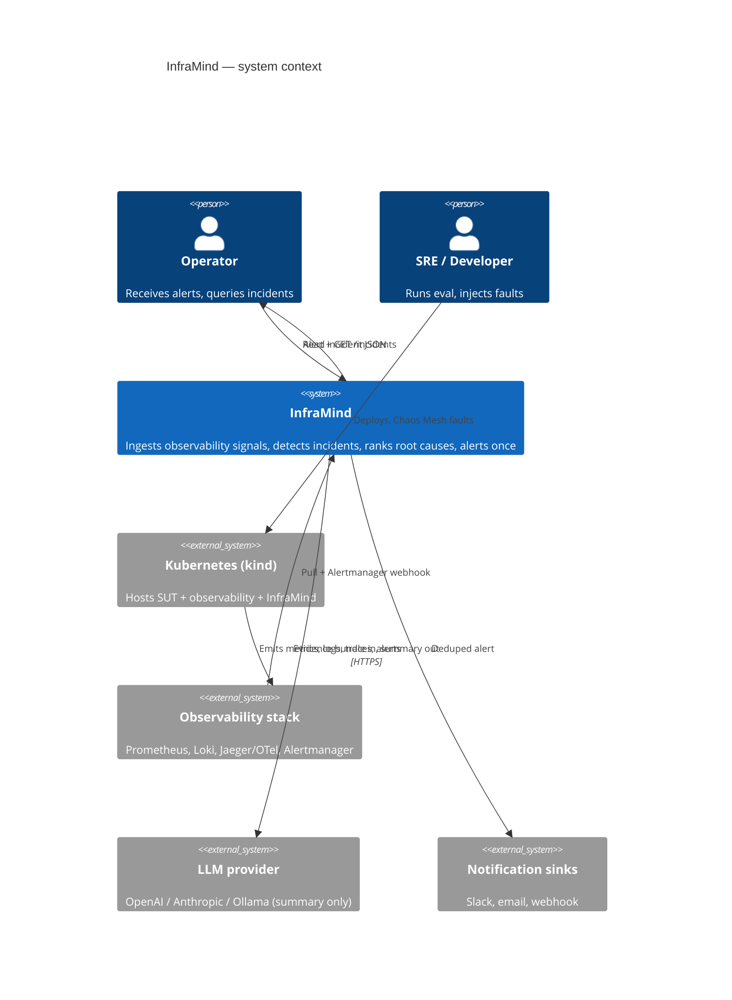
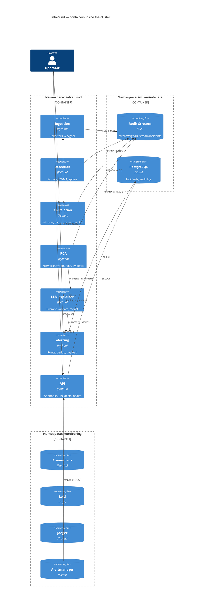
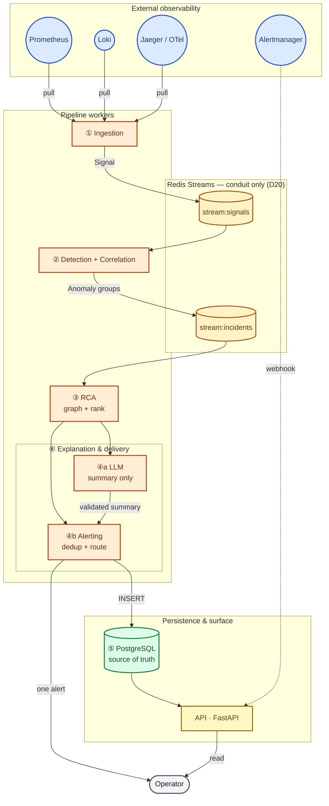
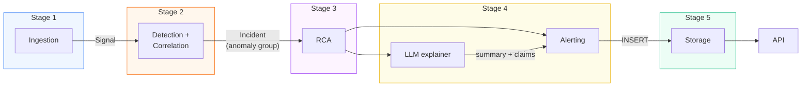
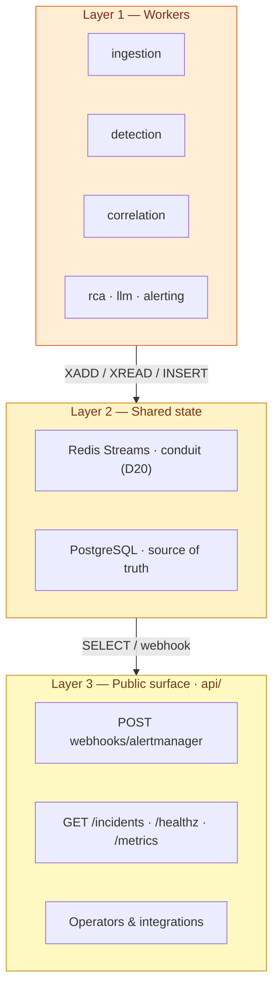
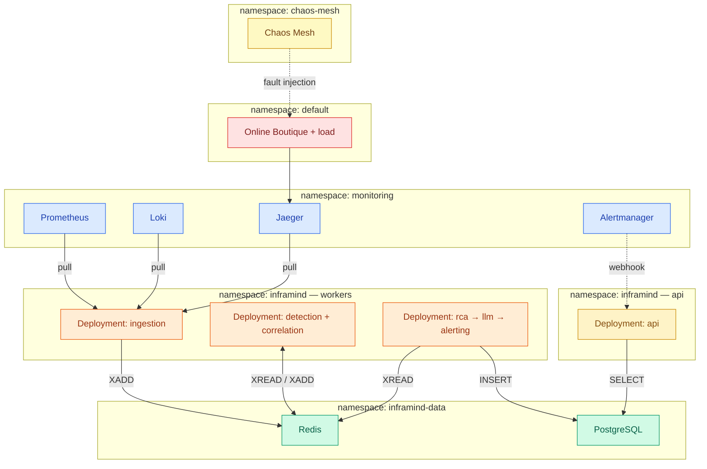
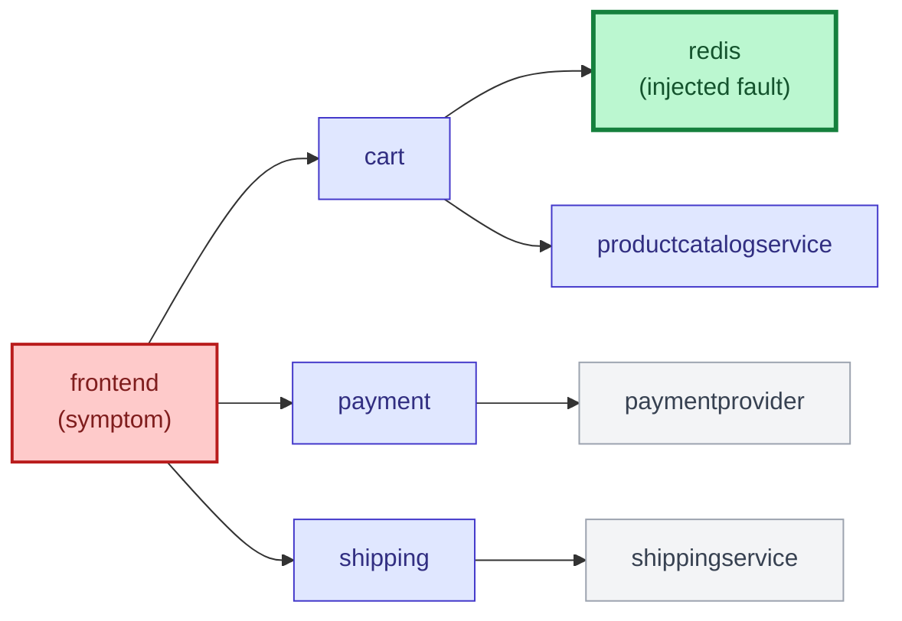
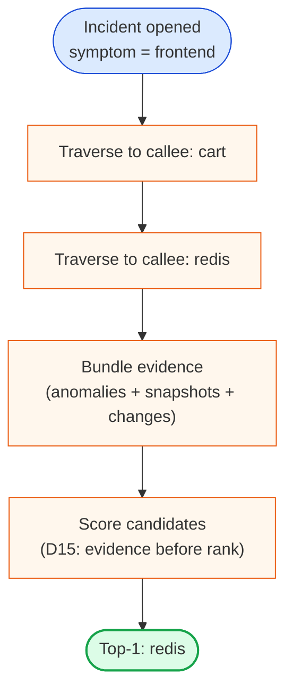
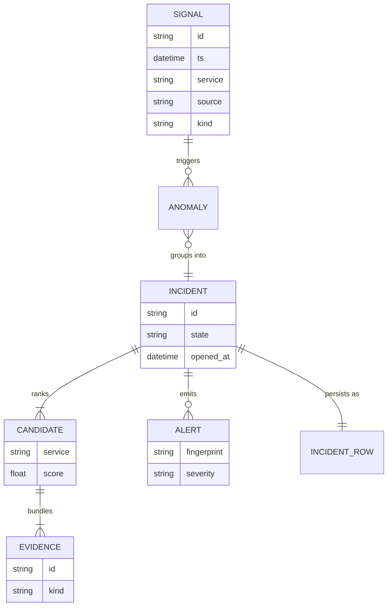

# Architecture — InfraMind

| | |
|---|---|
| **System** | InfraMind — multi-signal incident detection and graph-guided RCA on Kubernetes |
| **Status** | Target architecture (P0 scaffold; workers land P2–P8) |
| **Cluster** | `kind` only · SUT: Online Boutique · faults: Chaos Mesh |
| **Locked rules** | D1 deterministic RCA · D2 caller→callee · D9 LLM redaction |

InfraMind answers one question when a microservice fault occurs: **which service is the root
cause, with evidence**, delivered as **one deduplicated alert**. Root-cause **ranking is
deterministic**; the LLM **only summarises** the evidence bundle (D1). Long-lived workers
run on the test cluster; **Redis Streams** is the inter-stage conduit; **PostgreSQL** is the
source of truth.

| Document | Role |
|---|---|
| [`decision-tree.md`](decision-tree.md) | *Why* — locked decisions |
| [`surface-map.md`](surface-map.md) | *Wire shapes* — schemas, streams, API |
| [`standards/`](standards/README.md) | *How* — engineering conventions |

**Audience:** contributors, thesis §System Design, external reviewers.

---

## 1. System context (C4 — Level 1)



---

## 2. Container view (C4 — Level 2)



---

## 3. End-to-end data flow (one screen)

Solid lines: data path. Dashed: control or external push.



**Reading the diagram.** Collectors normalise backend payloads to `Signal`. Two stream
boundaries decouple workers: `stream:signals` after ingestion, `stream:incidents` after
correlation. RCA and downstream stages consume the incident stream; LLM and alerting share
the ranked result in-process before persistence.

---

## 4. Five-stage pipeline (proposal §3.2)

Aligned with the BSc proposal’s five layers; stage 4 splits into explainer + alerting.



| # | Stage | Package | Owner | Input | Output |
|---:|---|---|---|---|---|
| 1 | Ingestion | `ingestion/` | Moneem | PromQL, LogQL, traces, AM webhook | `Signal` → `stream:signals` |
| 2 | Detection + correlation | `detection/`, `correlation/` | Moneem | `Signal` | `Incident` / groups → `stream:incidents` |
| 3 | RCA | `rca/` **(core)** | Prome | Incidents + call graph | Ranked `Candidate[]` + `Evidence` |
| 4a | LLM explainer | `llm/` | Prome | Incident + candidates | `summary`, validated `claims[]` |
| 4b | Alerting | `alerting/` | Prome | Rank + summary | One deduped, routed alert |
| 5 | Storage | `storage/` | Prome | Rows | Postgres + audit log |
| — | API | `api/` | Prome | HTTP | Webhook ingress, `GET /incidents` |

**Pinned shapes:** [`surface-map.md`](surface-map.md) — `Signal`, `Anomaly`, `Incident`,
`Candidate`, `Evidence`, `Alert`.

**Adjacent (not runtime pipeline):**

| Area | Owner | Path |
|---|---|---|
| Testbed | Rifat | `testbed/` |
| Helm / `make up` | Rifat | `deploy/helm/inframind/` |
| Evaluation | Rifat | `evaluation/` |
| Agent workflow | team | `.claude/`, `docs/AGENT_WORKFLOW.md` |

---

## 5. Sequence — one fault, end to end

Typical path: redis unavailable; symptom at `frontend`; ~5 s to readable incident JSON.

```mermaid
sequenceDiagram
    autonumber
    box rgba(254,243,199,0.3) Evaluation
        actor Op as Operator
        participant CM as Chaos Mesh
    end
    box rgba(254,202,202,0.3) System under test
        participant SUT as Online Boutique
    end
    box rgba(219,234,254,0.3) Observability
        participant OBS as Prometheus / Loki / Jaeger
    end
    box rgba(255,237,213,0.3) InfraMind pipeline
        participant ING as Ingestion
        participant RS as Redis Streams
        participant DET as Detection
        participant COR as Correlation
        participant RCA as RCA engine
        participant LLM as LLM explainer
        participant ALT as Alerting
    end
    box rgba(220,252,231,0.3) Persistence
        participant PG as PostgreSQL
        participant API as API
    end

    Op->>CM: Apply PodChaos / network fault
    CM-->>SUT: Fault at t₀
    SUT-->>OBS: Metrics, logs, traces
    OBS-->>ING: Pull cycle
    ING->>RS: XADD stream:signals (Signal)
    RS-->>DET: XREAD
    Note over DET: Z-score fires (~t₀+1s)
    DET->>COR: Anomaly
    COR->>COR: Window + dedup
    COR->>RS: XADD stream:incidents
    RS-->>RCA: XREAD (~t₀+2s)
    RCA->>RCA: Walk toward callees (D2)
    RCA->>LLM: Incident + evidence bundle
    Note over LLM: Redact (D9); temperature=0
    LLM-->>RCA: Summary + claims (validated)
    RCA->>ALT: Rank + summary
    ALT->>ALT: Dedup, severity route
    ALT-->>Op: Single alert
    ALT->>PG: INSERT incident, evidence, audit
    Op->>API: GET /incidents/{id}
    API->>PG: SELECT
    PG-->>API: Row
    API-->>Op: 200 Incident JSON (~t₀+5s)
```

Timing varies with baseline warm-up, LLM retries, or dedup suppression; the **data flow**
does not change.

---

## 6. Logical layers



**Layer rules**

1. **No direct worker-to-worker calls across stage boundaries.** Consume the previous
   stage from Redis (or in-process only *after* the incident stream consumer, e.g. RCA → LLM).
2. **Publish at boundaries.** `stream:signals` after ingestion; `stream:incidents` after
   correlation.
3. **Bus ≠ truth (D20).** Postgres holds durable incidents; Redis may trim without losing
   audit data already inserted.
4. **HTTP ingress.** Alertmanager webhook → API; all other ingress is collector pull.

---

## 7. Kubernetes deployment (target — P8)



| Edge style | Meaning |
|---|---|
| Solid | Data path (pull, stream, SQL) |
| Dashed | Control (Chaos injection, Alertmanager push) |

**RBAC:** InfraMind `ServiceAccount`s — read-only `get/list/watch` on pods, logs, events,
configmaps; no `exec`, no writes. Details: [`standards/11-helm-packaging.md`](standards/11-helm-packaging.md).

*Diagram is the P8 target; P0 runs unit tests locally and `docker compose` for Redis/Postgres only.*

---

## 8. RCA — graph walk and scoring

Deterministic rank (D1); edges **caller → callee**; walk from **symptom toward callees** (D2).

### 8.1 Example topology (Online Boutique)





### 8.2 Scoring (default ranker)

```text
score(s) = w1 · anomaly_severity
         + w2 · earliest_onset
         + w3 · downstream_depth
         + w4 · change_correlation
```

**PageRank variant:** personalised PageRank on the call graph (α = 0.85), reported as
sensitivity analysis — not the production ranker (D7 baselines).

**Reproducibility:** `(graph, anomaly_set, seed)` fixes the rank; LLM uses `temperature=0`
and cache key `(scenario_id, prompt_version, evidence_bundle_hash, model)`.

Deep dive: [`standards/06-rca-scoring.md`](standards/06-rca-scoring.md),
[`standards/07-llm-explainer.md`](standards/07-llm-explainer.md).

---

## 9. Domain model (conceptual)



---

## 10. Design rationale (summary)

| Choice | Rationale |
|---|---|
| Five stages, one owner each | Swap detectors or RCA rankers without cross-team rewrites; replay fixtures from stream 3 onward |
| Deterministic RCA (D1) | Same evidence → same rank; LLM version cannot change the primary |
| Redis + Postgres (D20) | Decouple workers; refuse silent loss if Postgres is down |
| Statistical detection (D3) | BSc scope: Z-score, EWMA, spikes — no DL training |
| LLM summariser only | Matches proposal §3.2.4 and literature on hallucination risk |

---

## 11. Cross-reference index

| Topic | Location |
|---|---|
| Why (D1, D2, D4, D6, D7, D9, D15, D20) | [`decision-tree.md`](decision-tree.md) |
| Schemas, env, API routes | [`surface-map.md`](surface-map.md) |
| Team, hard rules, agents | [`CLAUDE.md`](../CLAUDE.md) |
| Conventions 01–12 | [`standards/README.md`](standards/README.md) |
| Paper | `paper/` |

---

*Plain-text fallback:* if Mermaid does not render in your viewer, open this file on GitHub or
in VS Code / Cursor with Mermaid preview; the tables above remain the canonical stage contract.
